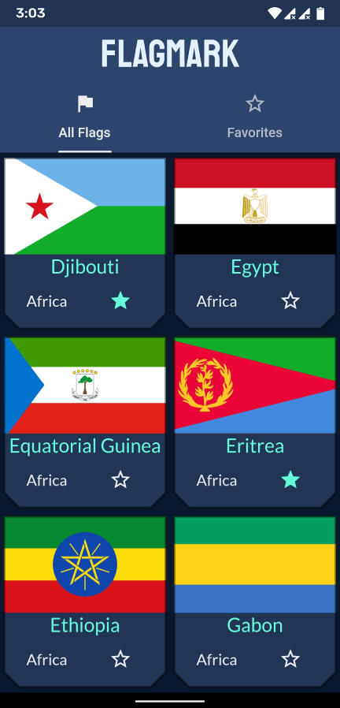
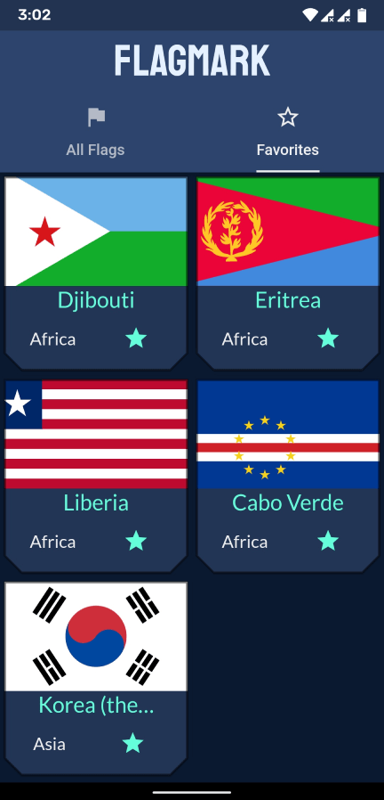

# FlagMark

A sample app that demonstrates MVVM architecture with Provider state management in Flutter.

The home screen displays a list of Country Cards. Users can mark multiple Country Cards as favorites.

The app asynchronously checks network connection on startup and fetch country data from an external API. In case of no internet connection, it will wait until mobile data or WiFi is turned on and automatically attempt to fetch data.

## Links

[Download](https://github.com/itsarjunsinh/flag_mark/releases) | [Watch Demo](https://youtu.be/ngKT_eVUUZo)

## License

This project is licensed under the [MIT License](LICENSE.md).
